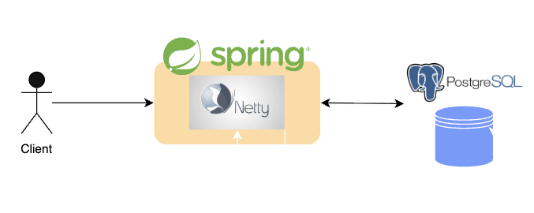
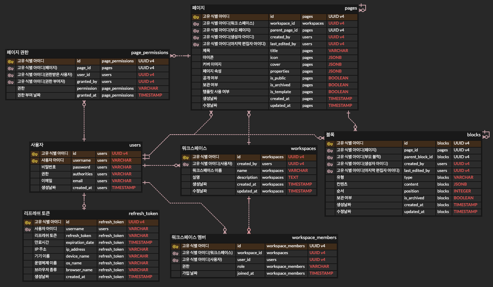
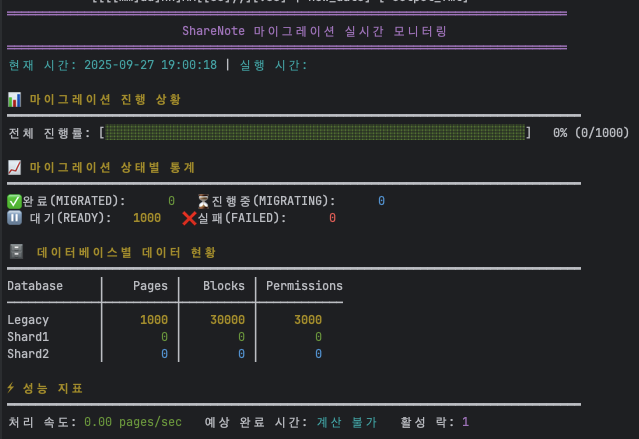
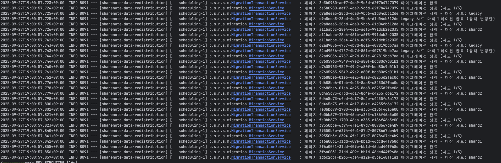
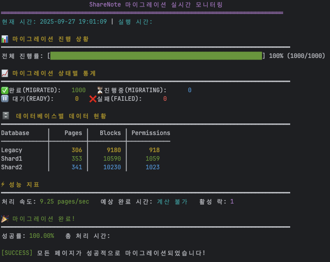

# 📗 공유 노트 프로젝트

- 노션과 같은 노트 서비스의 백엔드를 구현하는 프로젝트
- 사용자의 급증으로 데이터 양이 많아졌을 때, 어떻게 서버를 중단하지 않고 데이터베이스 서버를 확장할 것인지에 대한 문제를 해결해보는 프로젝트


# 🔥 프로젝트 주요 관심사항
- 개발 생산성 향상을 위한 테스트 코드(단위 테스트, 통합 테스트) 구현, 리액티브 프로그래밍에 대한 테스트 구현
- 이 프로젝트에서의 JWT 인증방식의 적합성 및 ```Spring Security```를 함께 활용하여 JWT 인증방식을 구현
- 응답성 향상 및 하드웨어 리소스를 최대한 사용하기 위해 ```Spring WebFlux```, ```Spring Data R2DBC```를 활용하여 리액티브(비동기, 논블로킹)한 로직 구현
- 문서 및 계층형 트리 데이터 어플리케이션 개발에서 다른 DB 소프트웨어 대비 ```PostgreSQL``` DB의 장점 및 활용
- 빠른 데이터 조회를 위한 인덱스 활용 및 어플리케이션 레벨의 쿼리 구현
- 수많은 사용자 유입을 고려한 데이터베이스 샤딩 방식 확장 및 샤딩키 전략 구현
- 대용량 데이터를 고려하여 무중단 어플리케이션 서비스 환경에서 샤드로 안전한 데이터 재분산을 위한 로직 구현 및 모니터링
- 무중단 점진적 데이터 재분산 과정에서 ```1️⃣ 클라이언트 요청``` 및 ```2️⃣ 데이터 재분산``` 작업의 동시성 문제 해결을 위한 레디스 분산락 활용
- 점진적 데이터 재분산 과정에서 레디스 서버 또는 어플리케이션 서버 장애시 대응 전략


# 🏢 아키텍처

## 점진적 데이터 재분산 전 아키텍처

- 공유 노트 프로젝트에서는 읽기, 쓰기 작업과 트래픽이 많다는 것을 가정한다. 이에 따라 웹 어플리케이션 서버 또한 많은 요청을 처리할 것이다. 상대적으로 느린 데이터베이스와의 통신 문제로 인해 톰캣 서버(블로킹 방식)을 사용하는 경우, 하드웨어의 리소스가 낭비된다. 이를 최대한 활용하기 위해 Spring WebFlux, R2DBC를 활용한다. ```Netty 엔진```은 비동기/논블로킹을 지원하는 대표적인 웹서버 엔진이며, Spring WebFlux 라이브러리를 추가하는 경우, 자동으로 ```Netty 엔진```이 구동된다.(단, Spring Web은 추가하지 않도록 주의하여야 한다.)
- 공유 노트 프로젝트의 데이터들은 주로 문서 데이터들이며, 또한 계층형 관계를 이룬다. 이 부분을 고려하면 DocumentDB처럼 활용하면서도 GraphDB처럼 쓸 수 있는 DB엔진이 필요하다. 또한, 여러 클라이언트가 하나의 데이터에 대해 동시에 조작하게 되는 동시성 문제가 있을 수 있기 때문에, 이 부분도 함께 고려하여야 한다. PostgreSQL은 계층형 관계 데이터를 다루기 적합하면서, JSONB 지원, MVCC 동시성 지원이 있기 때문에 이런 점에서 적절하다. 
## 점진적 데이터 재분산 진행 과정에서의 아키텍처

- 사용자가 많아지고 데이터 양이 많아짐에 따라 추가 DB 서버 추가가 필요해질 것이다. 이 프로젝트에서는 먼저 많은 데이터 양에 대한 ```1️⃣ DB 서버 확장``` 및 ```2️⃣ 부하부산```을 목적으로 하고 있다. 이 점을 고려할 때, 복제(Replication) 방식보다는 샤딩(Sharding)방식이 더 적절할 것이다.
- 샤딩 방식을 선택할 때, legacy DB 서버를 계속해서 사용하는 경우, 해당 DB 서버가 다른 샤드에 비해 당연히 데이터가 많을 것이고, 상대적으로 많은 부하가 지속될 것이다. 이 문제를 해결하기 위해 데이터 재분산(Data Redistribution) 작업이 필요하다.
- 데이터가 10~100GB 이하의 양이라면 웹 어플리케이션을 중단시키고 빠르게 마이그레이션한 후 다시 배포하는 것도 선택해 볼 수 있겠지만, 데이터가 많을수록 중단되는 시간은 길어질 것이고 이는 사용자에게 큰 불편함을 줄 것이다. 이를 고려하여 이 프로젝트에서는 어플리케이션 서버를 중단시키지 않으면서도, 점진적으로 데이터를 재분산시키는 전략을 생각하였다.
- 데이터 재분산을 담당하는 웹 어플리케이션은 주로 재분산이라는 이 하나의 작업만 담당하게 될 것이기 때문에 내장서버는 `톰캣(Tomcat) 엔진`으로 구동시킨다.
- 무중단 데이터 재분산을 진행하는 경우, 크게 고려할 점들이 몇가지 있다.
  - 클라이언트 요청과 데이터 재분산 작업을 진행하는 어플리케이션의 데이터 제어에 의해 동시성 문제가 발생한다. 데이터에 락을 거는 것이 필요하다.
  - 트래픽이 많은 경우, DB에서 락을 건다면 응답성이 많이 느려질 수 있으며, 또한 분산 데이터베이스이기 때문에 전체적인 락이 불가능하다. 이를 해결하기 위해 레디스를 분산락으로 활용한다.
  - 데이터 재분산 작업 과정에서 어플리케이션이 중단되었다가 다시 실행되거나 또는 재분산 작업을 진행하는 과정에서 데이터 정합성이 반드시 요구된다. 그렇기 때문에 데이터 마이그레이션 후 정합성을 지키기 위해 ```1️⃣ 재확인``` 및 ```2️⃣ 기존 데이터 제거```, ```3️⃣ 롤백```, ```4️⃣ 모니터링 및 알림```, ```5️⃣ 장애 원인 파악``` 등을 함께 고려하고, 적절한 순서로 진행되어야 한다.
  - 데이터 재분산을 위한 웹 어플리케이션 서버나 분산락을 위한 레디스 서버에 장애가 생기는 경우에 대한 적절한 대처도 필요하다. 레디스에 장애가 생기는 경우, 기존의 클라이언트 요청을 처리하는 웹서버에서는 이와 상관없이 샤딩기법으로 데이터를 제어할 수 있어야 한다. 반대로 데이터 재분산 웹서버에 장애가 생기는 경우, 분산락에 적절한 TTL 설정을 통해, 기존의 클라이언트 요청을 처리하는 서버는 락에 영향을 받지 않고 지속적으로 데이터를 처리할 수 있어야 한다.


# 💾 ERD



- 페이지 및 블록은 ```페이지 ➡️ 페이지```, ```블록 ➡️ 블록```과 같은 계층형 관계 또한 가진다.


# 🧊 점진적 데이터 재분산 처리 흐름

1. 인덱스 설정(migration_status, updated_at)
   - 이유 : 먼저 마이그레이션 되지 않은 데이터들 중에 가장 오래전에 변경된 데이터들부터 데이터를 읽어와서 마이그레이션을 진행하기 위함이다. 업데이트 날짜가 오래되었다는 것은, 마이그레이션이 진행되는 과정에서 클라이언트가 해당 데이터를 변경하게 되는 요청을 보낼 확률도 적다고 볼 수 있다. 이렇게 함으로써 동시성 발생확률을 최대한으로 줄일 수 있고, 클라이언트 요청의 처리에 대한 스레드의 대기 상태를 최대한으로 줄여줄 수 있다.
2. pages 테이블에 migration_status 컬럼 추가 및 기본값 READY로 설정
3. 새로운 샤드 인스턴스 및 분산락 용 레디스 서버 생성
4. 기존 어플리케이션 서버에서 샤딩을 통해 데이터를 저장하도록 로직 변경
   - 마이그레이션 진행 정도에 따라 로직을 결정
     - 50% 이하의 데이터가 마이그레이션된 경우
       1. 데이터를 제어할 때, 항상 레디스 분산락으로부터 락이 걸렸는지 체크
       2. 마이그레이션 시작 날짜를 기준으로 이전에 생성된 데이터를 조작하는 경우, legacy DB 서버에서 먼저 데이터 조회 및 제어
       3. legacy DB에 데이터가 없는 경우, 해시기반 샤드키로 대상 샤드에서 데이터 제어
       4. 마이그레이션 시작 날짜 이후에 대한 데이터를 조작하는 경우, 바로 해시기반 샤드키로 대상 샤드로 바로 찾아가서 데이터 제어
     - 50% 이상의 데이터가 마이그레이션된 경우(로직 변경)
       1. 데이터를 제어할 때, 항상 레디스 분산락으로부터 락이 걸렸는지 체크
       2. 모든 데이터 조작에 대해, 해시기반 샤드키로 대상 샤드에서 데이터 제어
       3. 데이터 수정 요청에 대해, 대상 샤드에 데이터가 없는 경우, legacy DB 서버에서 데이터를 조회하여 수정 진행
     - 마이그레이션이 완료된 경우(legacy DB의 모든 데이터들의 migration_status가 MIGRATED로 된 경우)
       1. 항상 해시기반 샤드키에 의해서만 데이터를 제어하도록 로직 변경
5. 마이그레이션을 진행하는 스케쥴러 실행
   1. 마이그레이션이 되지 않았으며(migration_status가 READY), 수정날짜가 가장 오래된 페이지 데이터를 페이징(100개)으로 가져온다.
   2. 페이지를 배치 단위로 마이그레이션 진행. 배치 단위 내에서 하나의 페이지 단위로 마이그레이션 진행 (‼️마이그레이션 작업에 의해 updated_at 값이 변경되지 않도록 해야 함.)
      - 하나의 페이지 마이그레이션 진행과정
        1. 마이그레이션을 진행할 하나의 페이지에 대해 분산락을 건다.
        2. 마이그레이션 해당 페이지의 마이그레이션 상태를 MIGRATING으로 변경한다.
        3. 마이그레이션할 대상 샤드를 결정한다.(해시값으로 결정)
        4. 대상 샤드 결정과정에서, 마이그레이션 대상 샤드가 legacy로 결정된 경우, 마이그레이션 상태만 MIGRATED로 변경한다. (뒤의 과정은 진행하지 않는다.)
        5. 해당 페이지에 대한 블록, 페이지 권한 데이터를 legacy 서버로부터 읽어온다.
        6. 페이지, 페이지 권한, 블록 데이터들을 대상 샤드로 복제한다.
        7. 복제된 데이터를 검증한다.(해당 프로젝트에서는 legacy의 데이터와 복제된 shard의 데이터를 간단하게 개수만 비교함. 엄밀하게 검증을 하려면, 모든 데이터가 일치하는지 값을 비교하는 작업이 필요함.)
        8. 다른 샤드로 마이그레이션 된 경우, legacy DB의 데이터를 삭제한다.
        9. 복제 후 마이그레이션 상태를 MIGRATED로 변경한다.
      - 하나의 페이지 마이그레이션이 실패하는 경우, 최대 3번까지 마이그레이션 재시도를 진행한다.
      - 마이그레이션이 최종적으로 실패한 경우, 페이지 단위로만 롤백 작업 후 마이그레이션 상태를 FAILED로 변경한다.
      - 다음의 페이지 데이터를 마이그레이션 진행한다.
   3. migration_status가 READY인 데이터가 없는 경우, FAILED인 데이터를 찾아서 마이그레이션 재시도


# 🧩 점진적 데이터 재분산 장애 대응

### 1️⃣ 레디스 서버에 장애가 발생하였을 때

- 데이터 재분산 수행을 하는 어플리케이션은 레디스에 락을 생성할 수 없으므로 예외를 발생시키며 데이터 재분산 작업을 중단한다.
- MIGRATING 상태에 있던 페이지에 대해 마이그레이션 상태를 다시 READY로 변경하고, 다른 샤드로 복제된 데이터를 제거한다.
- 기존의 클라이언트 요청을 처리하는 웹 어플리케이션 서버는 레디스 분산락에서의 조회를 건너뛰고 샤딩 로직에 따라 각 샤드로부터 데이터를 확인하고 CRUD 작업을 수행한다.

### 2️⃣ 점진적 데이터 재분산 어플리케이션에 장애가 발생하였을 때

- 레디스 분산락에 걸려지는 락 데이터에 TTL을 설정하여 락 데이터가 만료될 수 있도록 하며, 기존의 클라이언트 요청을 처리하는 서버는 샤딩 로직에 따라 데이터를 처리할 수 있도록 한다.
- 데이터 재분산 어플리케이션 재실행시, MIGRATING 상태인 페이지에 대해 샤드로 복제된 데이터를 제거하고, 다시 분산락 생성 및 복제 작업을 진행한다.
- 위의 MIGRATING 상태의 페이지에 대한 재분산 작업이 끝나면 다시 기존의 로직에 따라 재분산 작업을 진행한다.


# ✅ 기능
- 사용자
  - 회원가입
  - 로그인(JWT 토큰 생성 및 재발급)
  - 로그아웃
- 워크스페이스
  - 워크스페이스 생성
  - 워크스페이스 수정
  - 워크스페이스 삭제
  - 멤버 초대
  - 멤버 목록 조회
  - 멤버 권한 수정
  - 멤버 내보내기
- 페이지
  - 페이지 생성
  - 페이지 목록 조회
  - 페이지 조회
  - 페이지 수정
  - 맴버 초대
  - 페이지 권한 수정
  - 페이지 공개 상태 수정
  - 페이지 보관(휴지통)
  - 페이지 복원
  - 페이지 삭제(완전 삭제)
- 블록
  - 블록 생성
  - 블록 목록 조회
  - 블록 조회
  - 블록 수정
  - 블록 이동
  - 블록 보관(휴지통)
  - 블록 복원

<br/>

- 데이터 재분산 및 샤딩
  - 샤딩
  - 데이터 재분산 실행
  - 데이터 재분산 롤백
  - 데이터 재분산 모니터링
  - 데이터 재분산 스케줄링


# 🧪 데이터 재분산 테스트
```shell
cd data-redistribution/docker

# 데이터베이스 컨테이너 생성 및 테이블, 인덱스 초기화
./setup-test-env.sh

# 테스트용 재분산(마이그레이션) 테스트 데이터 생성
./migration-test.sh
```

```shell
cd data-redistribution

# 재분산 어플리케이션 실행
../gradlew bootRun
```

```shell
cd data-redistribution/docker

# 재분산 진행상황 모니터링
./monitor-migration.sh
```


# 📊 데이터 재분산 테스트 결과
## 데이터 세팅


- 페이지 데이터 1000개
- 페이지 1개당 블록 데이터 30개
- 페이지 1개당 페이지 권한 데이터 3개


## 재분산 시작전 모니터링 화면



- 데이터가 legacy에만 있는 상태

## 재분산 동작중 로그


## 재분산 완료후 모니터링 상황


- 페이지 기준 Legacy 306개, Shard1 353개, Shard2 341개로 거의 균등하게 마이그레이션 됨
- 해시기반 샤드키로 UUID를 사용하였을 때, UUID 생성 라이브러리에 의해 키를 랜덤하게 생성하고, 해시기반 샤드키로 샤딩을 하더라도 데이터가 거의 균등하게 분배되기 때문에 ```UUID를 해시기반 샤드키로 사용하는 것```이 ```✅ 보안적 측면```, ```✅ 균등한 분배``` 목적에서 적절함.


# 💥 기술적 이슈

1. [JWT 인증 방식에서 보안을 고려한 Access Token, Refresh Token 관리 방법](https://velog.io/@jeongegg/JWT-%EC%9D%B8%EC%A6%9D-%EB%B0%A9%EC%8B%9D%EC%97%90%EC%84%9C-%EB%B3%B4%EC%95%88%EC%9D%84-%EA%B3%A0%EB%A0%A4%ED%95%9C-Access-Token-Refresh-Token-%EA%B4%80%EB%A6%AC-%EB%B0%A9%EB%B2%95)
2. [Spring MVC vs Spring WebFlux](https://velog.io/@jeongegg/Spring-MVC-vs-Spring-WebFlux)
3. [Reactive Spring Security의 구조와 동작 및 구현[JWT 인증방식]](https://velog.io/@jeongegg/Reactive-Spring-Security%EC%9D%98-%EA%B5%AC%EC%A1%B0%EC%99%80-%EB%8F%99%EC%9E%91-%EB%B0%8F-%EA%B5%AC%ED%98%84JWT-%EC%9D%B8%EC%A6%9D%EB%B0%A9%EC%8B%9D)
4. [복잡한 문서구조(노션) 어플리케이션 개발에서 DB로써 PostgreSQL의 적합성(vs MySQL, Neo4j)](https://velog.io/@jeongegg/%EB%B3%B5%EC%9E%A1%ED%95%9C-%EB%AC%B8%EC%84%9C%EA%B5%AC%EC%A1%B0%EB%85%B8%EC%85%98-%EC%96%B4%ED%94%8C%EB%A6%AC%EC%BC%80%EC%9D%B4%EC%85%98-%EA%B0%9C%EB%B0%9C%EC%97%90%EC%84%9C-PostgreSQL%EC%9D%98-%EC%A0%81%ED%95%A9%EC%84%B1-vs-MySQL-Neo4j)
5. [개발자를 위한 PostgreSQL 심층 탐구: 성능, 확장성, 그리고 유연성](https://velog.io/@jeongegg/PostgreSQL-Deep-Dive)
6. [데이터 무결성을 보장하기 위한 트리거(Trigger) 활용](https://velog.io/@jeongegg/%EB%8D%B0%EC%9D%B4%ED%84%B0-%EB%AC%B4%EA%B2%B0%EC%84%B1%EC%9D%84-%EB%B3%B4%EC%9E%A5%ED%95%98%EA%B8%B0-%EC%9C%84%ED%95%9C-%ED%8A%B8%EB%A6%AC%EA%B1%B0Trigger-%ED%99%9C%EC%9A%A9)
7. [샤딩(Sharding) 키 관리 전략 5가지](https://velog.io/@jeongegg/%EB%8D%B0%EC%9D%B4%ED%84%B0%EB%B2%A0%EC%9D%B4%EC%8A%A4-%EC%83%A4%EB%94%A9)

## 기술스택

```JAVA```

```Spring Boot```  ```Spring Security```  ```Spring WebFlux```  ```Spring Data R2DBC``` ```Spring Data JPA``` ```Spring Data Redis```

```PostgreSQL```  ```Redis```

```Docker```  ```shell```