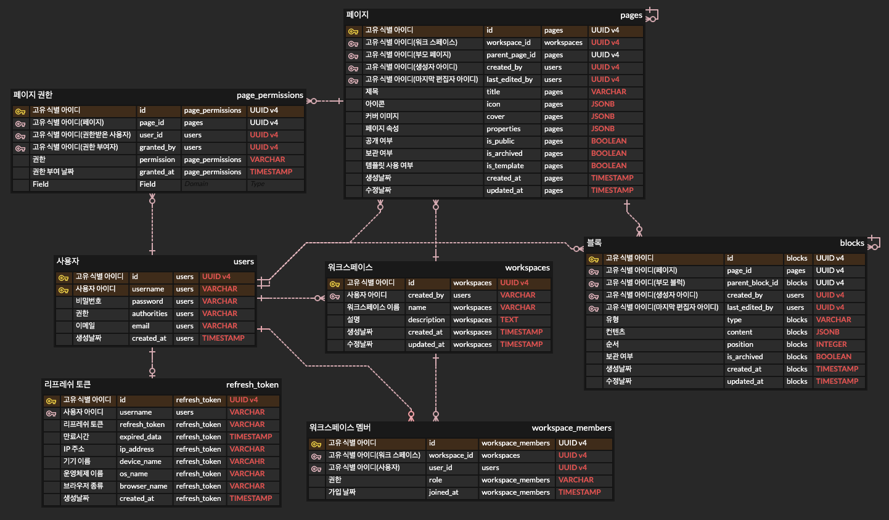

# 📗 공유 노트 프로젝트

- 노션과 같은 노트 서비스의 백엔드를 구현하는 프로젝트
- 사용자의 급증으로 데이터 양이 많아졌을 때, 어떻게 서버를 중단하지 않고 데이터베이스 서버를 확장할 것인지에 대한 문제를 해결해보는 프로젝트

---
# 🔥 프로젝트 주요 관심사항
- 개발 생산성 향상을 위한 테스트 코드(단위 테스트, 통합 테스트) 구현, 리액티브 프로그래밍에 대한 테스트 구현
- 이 프로젝트에서의 JWT 인증방식의 적합성 및 ```Spring Security```를 함께 활용하여 JWT 인증방식을 구현
- 응답성 향상 및 하드웨어 리소스를 최대한 사용하기 위해 ```Spring WebFlux```, ```Spring R2DBC```를 활용하여 리액티브(비동기, 논블로킹)한 로직 구현
- 문서 및 계층형 트리 데이터 어플리케이션 개발에서 다른 DB 소프트웨어 대비 ```PostgreSQL``` DB의 장점 및 활용
- 빠른 데이터 조회를 위한 인덱스 활용 및 어플리케이션 레벨의 쿼리 구현
- 수많은 사용자 유입을 고려한 데이터베이스 샤딩 방식 확장 및 샤딩키 전략 구현
- 대용량 데이터를 고려하여 무중단 어플리케이션 서비스 환경에서 샤드로 안전한 데이터 재분산을 위한 로직 구현 및 모니터링
- 무중단 데이터 재분산 과정에서 ```1️⃣ 클라이언트 요청``` 및 ```2️⃣ 데이터 재분산``` 작업의 동시성 문제 해결을 위한 레디스 분산락 활용
- 데이터 재분산 과정에서 레디스 서버 또는 어플리케이션 서버 장애시 대응 전략
---
# 🏢 아키텍처

## 데이터 재분산 전 아키텍처

- 공유 노트 프로젝트에서는 읽기, 쓰기 작업과 트래픽이 많다는 것을 가정한다. 이에 따라 웹 어플리케이션 서버 또한 많은 요청을 처리할 것이다. 상대적으로 느린 데이터베이스와의 통신 문제로 인해 톰캣 서버(블로킹 방식)을 사용하는 경우, 하드웨어의 리소스가 낭비된다. 이를 최대한 활용하기 위해 Spring WebFlux, R2DBC를 활용한다. Netty 엔진은 비동기/논블로킹을 지원하는 대표적인 웹서버 엔진이며, Spring WebFlux 라이브러리를 추가하는 경우, 자동으로 Netty 엔진이 구동된다.(단, Spring Web은 추가하지 않도록 주의하여야 한다.)
- 공유 노트 프로젝트의 데이터들은 주로 문서 데이터들이며, 또한 계층형 관계를 이룬다. 이 부분을 고려하면 DocumentDB처럼 활용하면서도 GraphDB처럼 쓸 수 있는 DB엔진이 필요하다. 또한, 여러 클라이언트가 하나의 데이터에 대해 동시에 조작하게 되는 동시성 문제가 있을 수 있기 때문에, 이 부분도 함께 고려하여야 한다. PostgreSQL은 계층형 관계 데이터를 다루기 적합하면서, JSONB 지원, MVCC 동시성 지원이 있기 때문에 이런 점에서 적절하다. 
## 데이터 재분산 진행 과정에서의 아키텍처

- 사용자가 많아지고 데이터 양이 많아짐에 따라 추가 DB 서버 추가가 필요해질 것이다. 이 프로젝트에서는 먼저 많은 데이터 양에 대한 ```1️⃣ DB 서버 확장``` 및 ```2️⃣ 부하부산```을 목적으로 하고 있다. 이 점을 고려할 때, 복제(Replication) 방식보다는 샤딩(Sharding)방식이 더 적절할 것이다.
- 샤딩 방식을 선택할 때, legacy DB 서버를 계속해서 사용하는 경우, 해당 DB 서버가 다른 샤드에 비해 당연히 데이터가 많을 것이고, 상대적으로 많은 부하가 지속될 것이다. 이 문제를 해결하기 위해 데이터 재분산(Data Redistribution) 작업이 필요하다.
- 데이터가 10~100GB 이하의 양이라면 웹 어플리케이션을 중단시키고 빠르게 마이그레이션한 후 다시 배포하는 것도 선택해 볼 수 있겠지만, 데이터가 많을수록 중단되는 시간은 길어질 것이고 이는 사용자에게 큰 불편함을 줄 것이다. 이를 고려하여 이 프로젝트에서는 어플리케이션 서버를 중단시키지 않으면서도, 점진적으로 데이터를 재분산시키는 전략을 생각하였다.
- 데이터 재분산을 담당하는 웹 어플리케이션은 주로 재분산이라는 이 하나의 작업만 담당하게 될 것이기 때문에 내장서버는 톰캣엔진으로 구동시킨다.
- 무중단 데이터 재분산을 진행하는 경우, 크게 고려할 점들이 몇가지 있다.
  - 클라이언트 요청과 데이터 재분산 작업을 진행하는 어플리케이션의 데이터 제어에 의해 동시성 문제가 발생한다. 데이터에 락을 거는 것이 필요하다.
  - 트래픽이 많은 경우, DB에서 락을 건다면 응답성이 많이 느려질 수 있으며, 또한 분산 데이터베이스이기 때문에 전체적인 락이 불가능하다. 이를 해결하기 위해 레디스를 분산락으로 활용한다.
  - 데이터 재분산 작업 과정에서 어플리케이션이 중단되었다가 다시 실행되거나 또는 재분산 작업을 진행하는 과정에서 데이터 정합성이 반드시 요구된다. 그렇기 때문에 데이터 마이그레이션 후 정합성을 지키기 위해 ```1️⃣ 재확인``` 및 ```2️⃣ 기존 데이터 제거```, ```3️⃣ 롤백```, ```4️⃣ 모니터링 및 알림```, ```5️⃣ 장애 원인 파악``` 등을 함께 고려하고, 적절한 순서로 진행되어야 한다.
  - 데이터 재분산을 위한 웹 어플리케이션 서버나 분산락을 위한 레디스 서버에 장애가 생기는 경우에 대한 적절한 대처도 필요하다. 레디스에 장애가 생기는 경우, 기존의 클라이언트 요청을 처리하는 웹서버에서는 이와 상관없이 샤딩기법으로 데이터를 제어할 수 있어야 한다. 반대로 데이터 재분산 웹서버에 장애가 생기는 경우, 분산락에 적절한 TTL 설정을 통해, 기존의 클라이언트 요청을 처리하는 서버는 락에 영향을 받지 않고 지속적으로 데이터를 처리할 수 있어야 한다.

---
# 💾 ERD



- 페이지 및 블록은 ```페이지 ➡️ 페이지```, ```블록 ➡️ 블록```과 같은 계층형 관계 또한 가진다.
---

## ✅ 기능
- 사용자
  - 회원가입
  - 로그인(JWT 토큰 생성 및 재발급)
  - 로그아웃
- 워크스페이스
  - 워크스페이스 생성
  - 워크스페이스 수정
  - 워크스페이스 삭제
  - 멤버 초대
  - 멤버 목록 조회
  - 멤버 권한 수정
  - 멤버 내보내기
- 페이지
  - 페이지 생성
  - 페이지 목록 조회
  - 페이지 조회
  - 페이지 수정
  - 맴버 초대
  - 페이지 권한 수정
  - 페이지 공개 상태 수정
  - 페이지 보관(휴지통)
  - 페이지 복원
  - 페이지 삭제(완전 삭제)
- 블록
  - 블록 생성
  - 블록 목록 조회
  - 블록 조회
  - 블록 수정
  - 블록 이동
  - 블록 보관(휴지통)
  - 블록 복원

<br/>

- 데이터 재분산 및 샤딩
  - 샤딩
  - 데이터 재분산 실행
  - 데이터 재분산 롤백
  - 데이터 재분산 모니터링
  - 데이터 재분산 스케줄링

---

# 🧪 데이터 재분산 테스트
```shell
cd data-redistribution/docker

# 데이터베이스 컨테이너 생성 및 테이블, 인덱스 초기화
./setup-test-env.sh

# 테스트용 재분산(마이그레이션) 테스트 데이터 생성
./migration-test.sh
```

```shell
cd data-redistribution

# 재분산 어플리케이션 실행
../gradlew bootRun
```

```shell
cd data-redistribution/docker

# 재분산 진행상황 모니터링
./monitor-migration.sh
```

---

# 📊 데이터 재분산 테스트 결과
## 데이터 세팅


- 페이지 데이터 1000개
- 페이지 1개당 블록 데이터 30개
- 페이지 1개당 페이지 권한 데이터 3개


## 재분산 시작전 모니터링 화면


- 데이터가 legacy에만 있는 상태

## 재분산 동작중 로그


## 재분산 완료후 모니터링 상황


- 페이지 기준 Legacy 306개, Shard1 353개, Shard2 341개로 거의 균등하게 마이그레이션 됨
- 해시기반 샤드키로 UUID를 사용하였을 때, UUID 생성 라이브러리에 의해 키를 랜덤하게 생성하고, 해시기반 샤드키로 샤딩을 하더라도 데이터가 거의 균등하게 분배되기 때문에 ```UUID를 해시기반 샤드키로 사용하는 것```이 ```✅ 보안적 측면```, ```✅ 균등한 분배``` 목적에서 적절함.

---

## 기술스택

```JAVA```

```Spring Boot```  ```Spring Security```  ```Spring WebFlux```  ```Spring Data R2DBC``` ```Spring Data JPA``` ```Spring Data Redis```

```PostgreSQL```  ```Redis```

```Docker```  ```shell```